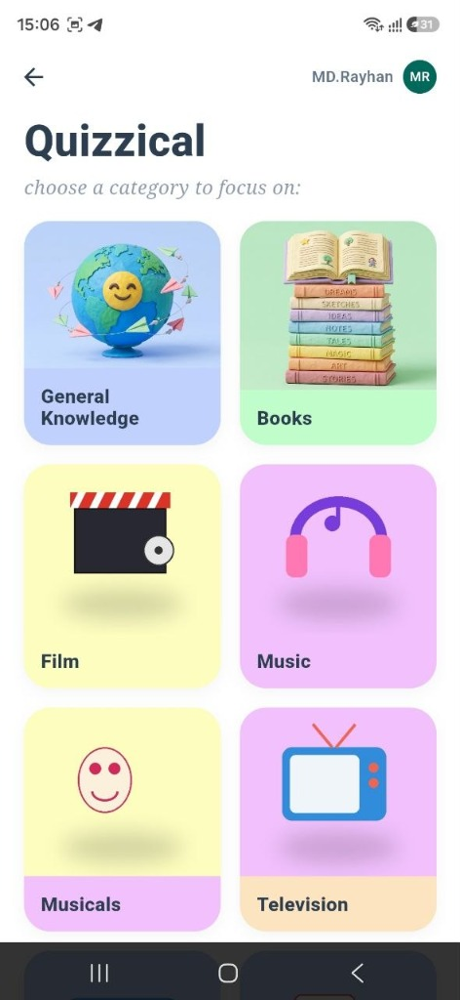
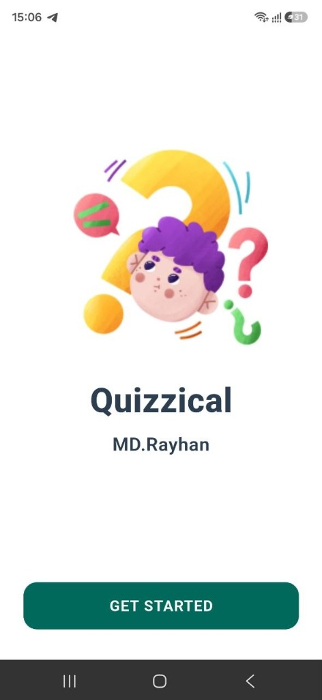
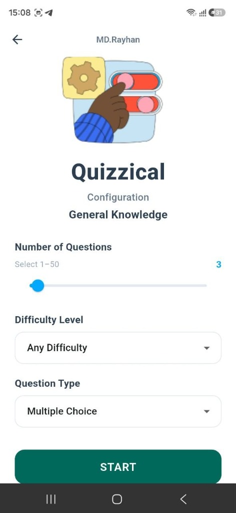
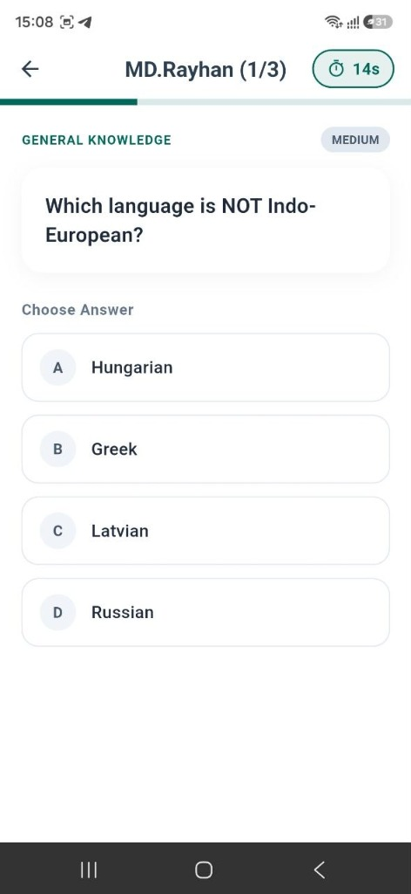
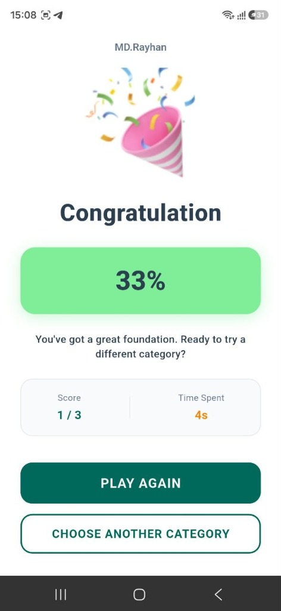

# Quizzical - Mobile Quiz Application 🧠

**Quizzical** is a modern, responsive, and accessible Flutter mobile quiz application built for the **CSE App Development Lab Exam** by **MD.Rayhan**.

The application integrates with the **OpenTDB REST API** to dynamically fetch trivia categories and questions, providing a sleek, interactive quiz gameplay experience with state management powered by **Provider** and persistent settings using **SharedPreferences**.

---

## 📱 App Screenshots

| Welcome Screen | Category Selection | Quiz Configuration | Quiz Screen | Results Screen |
| :---: | :---: | :---: | :---: | :---: |
|  |  |  |  |  |

---

## ✨ Features

- **Dynamic OpenTDB API Integration**:
  - Fetches live categories (`GET https://opentdb.com/api_category.php`).
  - Fetches customizable quiz questions (`GET https://opentdb.com/api.php`).
  - Handles API response codes (0 = Success, 1 = No Results, 2 = Invalid Parameter, 5 = Rate Limit).
  - Safe HTML entity decoding via `html_unescape` (`&quot;`, `&#039;`, `&amp;`, `&eacute;`).

- **Session Category Caching**:
  - Categories are fetched **once per session** and cached in memory using `CategoryProvider`, avoiding redundant network requests.

- **Custom 3D Category Artwork**:
  - High-definition 3D claymation image assets for trivia categories (General Knowledge, Books, History, Science & Nature, Art, Vehicles, Film, Music, TV, Video Games, Sports, Computers, etc.).

- **Quiz Configuration**:
  - Select question count via interactive slider (1–50, default 10).
  - Choose difficulty level (*Any*, *Easy*, *Medium*, *Hard*).
  - Select question type (*Multiple Choice* or *True / False*).
  - Persists chosen settings across sessions via `SharedPreferences`.

- **Interactive Quiz Gameplay**:
  - Question counter (`Question X of Y`) with live progress bar.
  - 20-second countdown timer per question with visual urgency indicator when $\le 5\text{s}$.
  - Instant visual feedback (Green for correct answer, Red for incorrect answer).
  - Score updates strictly once per question.

- **Results & Replay**:
  - Prominent performance summary ("You scored X/Y!").
  - Statistics cards: Score, Accuracy %, and Total Time Spent.
  - "PLAY AGAIN" button resets state while preserving your chosen configuration.
  - "CHOOSE ANOTHER CATEGORY" button to select a new topic.

---

## 🛠 Tech Stack & Dependencies

- **Framework**: Flutter (Dart SDK)
- **State Management**: `provider: ^6.1.2`
- **Networking**: `http: ^1.2.1`
- **Storage**: `shared_preferences: ^2.2.3`
- **Text Decoding**: `html_unescape: ^2.0.0`

---

## 📁 Project Architecture

```
lib/
├── main.dart                   # Entry point initializing MultiProvider
├── app/
│   ├── app.dart               # MaterialApp setup
│   ├── routes.dart            # Named route definitions
│   └── theme.dart             # Custom light theme & color palette
│
├── models/
│   ├── category_model.dart     # Category JSON data model
│   ├── question_model.dart     # Question JSON data model & answer shuffling
│   └── quiz_config_model.dart  # Quiz settings data model
│
├── services/
│   └── api_service.dart       # OpenTDB REST API HTTP service
│
├── providers/
│   ├── category_provider.dart  # Category state & session caching
│   └── quiz_provider.dart      # Quiz gameplay state, timer & SharedPreferences
│
├── screens/
│   ├── welcome_screen.dart     # Entry screen with MD.Rayhan branding
│   ├── category_screen.dart    # Grid view of 3D category cards
│   ├── quiz_config_screen.dart # Slider & dropdown options
│   ├── quiz_screen.dart        # Question card, countdown timer & options
│   └── result_screen.dart      # Final score, accuracy & replay CTAs
│
├── widgets/
│   ├── category_card.dart      # 3D illustration card widget
│   ├── answer_button.dart      # Accessible answer button with state feedback
│   ├── loading_skeleton.dart   # Skeleton loader animation
│   └── retry_banner.dart       # Network error & retry widget
│
└── utils/
    └── html_utils.dart         # HTML entity unescaping utility
```

---

## 🚀 Getting Started

### Prerequisites

Ensure you have installed:
- [Flutter SDK](https://docs.flutter.dev/get-started/install) (v3.18.0 or newer)
- Dart SDK
- Android Studio or VS Code with Flutter extension

### Installation

1. Clone the repository:
   ```bash
   git clone https://github.com/Rayhan22CSE/quizzical-mobile-app.git
   cd quizzical-mobile-app
   ```

2. Install dependencies:
   ```bash
   flutter pub get
   ```

3. Run static analysis:
   ```bash
   flutter analyze
   ```

4. Run unit and widget tests:
   ```bash
   flutter test
   ```

5. Launch the application on connected device or emulator:
   ```bash
   flutter run
   ```

---

## 🧪 Testing

The codebase includes automated unit and widget tests covering:
1. Category JSON parsing and HTML decoding
2. Question JSON parsing and safe answer shuffling
3. Special character unescaping via `HtmlUtils`
4. Score and accuracy calculation logic
5. Quiz reset and configuration persistence
6. `WelcomeScreen` initial render

Run all tests via:
```bash
flutter test
```

---

## 👤 Author

**MD.Rayhan**  
Department of Computer Science & Engineering (CSE)  
GitHub: [@Rayhan22CSE](https://github.com/Rayhan22CSE)
